# Royal Canal BJJ

[Live Webpage](https://icemanmick.github.io/ci_pp1_royal-canal-bjj/index.html) 

## Table of Contents

1. [Introduction](#introduction)
    1. [Background](#background)
2. [Objectives](#objectives)
    1. [Site Visitors](#site-visitors)
    2. [Site Owners](#site-owners)
3. [User Stories](#user-stories)
4. [Website Design](#website-design)
    1. [Layout](#layout)
    2. [Colour Choices](#colour-choices)
    3. [Structure](#structure)
    4. [Wireframes](#wireframes)
    5. [Font](#font)
5. [Features](#features)
    1. [Navigation Menu](#navigation-menu)
    2. [Facilities](#facilities)
    3. [Benefits](#benefits)
    4. [Sign Up Button](#sign-up-button)
    5. [About Us](#about-us)
    6. [Coaches](#coaches)
    7. [Timetable](#timetable)
    8. [Class and Pricing Information](#class-and-pricing-information)
    9. [Form](#form)
    10. [Contact and Public Transport Information](#contact-and-public-transport-information)
    11. [Map](#map)
    12. [Social Media](#social-media)
    13. [Future Ideas](#future-ideas)
6. [Testing](#testing)
    1. [HTML Validation](#html-validation)
    2. [CSS Validation](#css-validation)
    3. [Performance](#performance)
    4. [Accessibilty](#accessibility)
    5. [Browsers](#browsers)
    6. [Devices](#devices)
7. [Unfixed Bugs](#unfixed-bugs)
8. [Deployment](#deployment)
9. [Technology Used](#technology-used)
10. [Credits](#credits)
    1. [Content](#content)
    2. [Media](#media)
11. [Final Thoughts](#final-thoughts)

> ## Introduction

### Background
Royal Canal BJJ is a fictious new Brazilian Jiu Jitsu gym which has opened in December 2021. It is located in the Royal Canal Park area of North Dublin, and from which it derives its name.

## Objectives

### Site Visitors
The objectives of the site visitors can be broken into two categories:
1. First Time Visitors;
2. Regular Visitors.

#### First Time Visitors want to know:
- What are the facilities of the gym?
- Are there benefits to starting BJJ?
- Is the gym located near me?
- What is the culture of the gym?
- Who are the coaches and what is their experience?
- How can I join?

#### Returning Visitors want to know?
- Are there any new developments at the gym?
- Does the gym have a social media presence and how can I find it?
- My schedule has changed and are there alternative class times?
- Can I contact the coaches outside of training times?
- Are there any public transport options near the gym?

### Site Owners
The objectives of site owners are:
- To attract new members to the gym.
- To inform potential new members of the facilities at the gym.
- To inform potential new members of the benefits of starting Brazilian Jiu Jitsu.
- To update new and current members on any new developments in the gym such e.g. shop opening soon and kids classes to be offered in the future.
- To make new and current members aware of the gym's social media presence and grow it.
- To provide information on contacting the gym.
- To provide advise on public transport services near the gym.

## User Stories

### First Time Users

1. As a first time user, I want to know where the BJJ gym is located.
2. As a first time user, I want to know when classes take place.
3. As a first time user, I want to know how much classes cost.
4. As a first time user, I want to know how experienced the coaches are.
5. As a first time user, I want to know how I can join this gym.
6. As a first time user, I want to know what the benefits are of learning BJJ.

### Returning Users

7. As a returning user, I want to find out alternative class times in case I cannot attend my regular class.
8. As a returning user, I want to know how I can contact the coaches outside of training times.
9. As a returning user, I want to know if the gym has a social media presence and how I can find it.
10. As a returning user, I want to know what public transport services are near the gym, in the event that my regular mode of transport is compromised or I am travelling from a different direction.
11. As a returning user, I want to know of any upcoming news or changes with the gym.

### Site Owners

12. As a site owner, I want to provide new members with background information on my gym.
13. As a site owner, I want to provide showcase my coaches BJJ credentials and experience.
14. As a site owner, I want to my website to be visually appealing and easy to navigate.
15. As a site owner, I want new members to be able to easily join my gym.
16. As a site owner, I want to update my current and new members with any new developments at the gym.

## Website Design

### Layout

As with Jiu Jitsu, simplicity is usually the key to victory. With this in mind the layout of the website has been kept simple. This is to allow the user to have a positive experience without being overwhelmed by too many images or options to click on.

The website consists of four pages:
- Home Page
- About Us
- Classes
- Contact Us

### Colour Choices
The main colour choices of the website are in reference to the Brazilian flag.
A green background, being the larger colour on the flag with a yellow sign up button, and blue lettering located in the sign up button.

A white background with black text was chosen for the header, footer, and information boxes to allow for easy reading.

### Structure
Each page layout is similar, with a navigation menu at the top, an image below the navigation menu, and the subsequent information relating to that page name located below that image. All images and information are centered for a pleasant user experience, removing the need to search around the webpage for features. Users quickly become accustomed to information location.

The Home Page, About Us Page, and Classes Page all feature a "Sign Up Today!!" button to drive users towards joining the gym. This button links to the internal webpage of "Contact Us" where the sign up form is located.

### Wireframes

Wireframes were created using the programme Balsamiq.

Home

About Us

Classes

Contact Us

### Font

Lora from [Google Fonts](https://fonts.google.com/specimen/Lora?query=lora) was used for the website. Alternative fallback font used was Sans-Serif.

## Features

### Navigation Menu

- The Navigation Menu rests at the top of each webpage. 
- By clicking on the Royal Canal BJJ logo you are returned each time to the home screen.
- A black line appears under the wording of whichever page the user is currently on.
- User Stories satisfied: Number 5, 14, 15

### Facilities

- A list of the gyms facilities are present on the Home page.
- Icons were added from [Font Awesome](https://fontawesome.com/sessions/sign-in?next=%2Fkits%2F5a97decf8e%2Fuse) website to make it more user friendly.
- Opportunity used on the home page for news of a "SHOP - COMING SOON!!!". Used as a selling point to show the entrepreneurship of the site owners and to gain the interest of site visitors. Shop will sell BJJ related equipment and apparel.
- User Stories satisfied: Number 11, 12, 16

### Benefits

- A list of the benefits of doing Brazilian Jiu Jitsu, to entice new members and/or to remind members who may have not trained in a while.
- Icons were added from [Font Awesome](https://fontawesome.com/sessions/sign-in?next=%2Fkits%2F5a97decf8e%2Fuse) website to make it more user friendly.
- User Stories satisfied: Number 6

### Sign Up Button

- Encourages new members to sign up and join the gym.
- Present at the bottom of the Home page, About Us Page, and Classes Page, to consistingly remind a first time user to sign up.
- Background colour of button turns white when hovered over.
- Yellow and blue colours, surrounded by green background which are part of the Brazilian national flag.
- User Stories satisfied:  Number 5, 15

### About Us

- Provides background information on the gym.
- Informs user that gym is for all skill levels.
- Informs user that kids classes are coming soon and to "WATCH THIS SPACE"
- Provides information on the culture of the gym.
- Written in a light-hearted tone and encourages first time users to sign up.
- User Stories satisfied: Number 11, 12, 16

### Coaches

- Provides background profiles on the coaches.
- Images from Google Images used as stand in pictures for the fictious coaches.
- Profiles written in a light-hearted tone.
- User Stories satisfied: Number 4, 13

### Timetable

- Timetable prepared in MS Excel, and Snipping Tool used to convert to jpeg file.
- Again advertises that kids classes are coming soon.
- Classes colour coordinated for easy visual differentiation.
 - User Stories satisfied: Number 2, 7

### Class And Pricing Information

- Provides further information on classes related to Timetable.
- Advises users of cost per month of training and method of payment.
- User stories satisfied: Number 3, 12

### Form

- Form for joining Royal Canal BJJ.
- Only basic information required to simplify and encourage new memberships.
- Radio Buttons related to Benefits.
- "Sign Me Up" button consistent with button on other pages in terms of colouring and hover colouring.
- All aspects of form must be complete in order to be successfully submitted.
- User Stories satisfied: Number 5, 15

### Contact And Public Transport Information

- Provides mobile number and email address for contacting the coaches.
- As gym is fictious, so are the phone number and email address.
- Provides address of gym and encourages drop in visits, highlighting the friendly nature of the gym.
- Provides public transport information.
- User Stories satisfied: Number 1, 8, 10

### Map

-Interactive [Google Maps](https://www.google.com/maps/place/Pelletstown+Ave,+Ashtown,+Dublin/@53.377062,-6.321312,16z/data=!4m5!3m4!1s0x48670d97922217b1:0x5fb8d7b1313725!8m2!3d53.3766845!4d-6.3184163?hl=en) set to the Royal Canal Park area.
- User Stories satisfied: Number 1, 10

### Social Media

- Social Media links are present on all page footers.
- As Royal Canal BJJ is a fictious club, all links bring user to the external home page sites.
- Links are to Instagram, Facebook, Youtube, and Twitter.
- User Stories satisfied: Number 9

### Future Ideas

Future ideas include:
- Interactive Shop
- Kids Classes Timetable
- Gallery of images
- Dedicated news section
- Youtube clips of instructional techniques

## Testing

Testing was conducted across six main categories consisting of:
1. HTML Validation
2. CSS Validation
3. Performance
4. Accessibility
5. Browsers
6. Devices

Each of the following four pages were tested in the above categories:

1. Home
2. About Us
3. Classes
4. Contact Us

### HTML Validation

The HTML of each of the four pages was passed through the [W3C HTML Validator Website](https://validator.w3.org/). Each page returned no errors.

Home
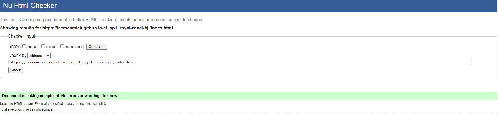

About Us
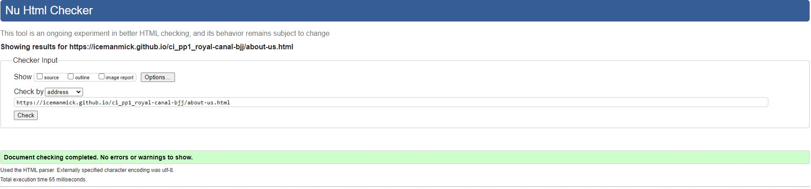

Classes
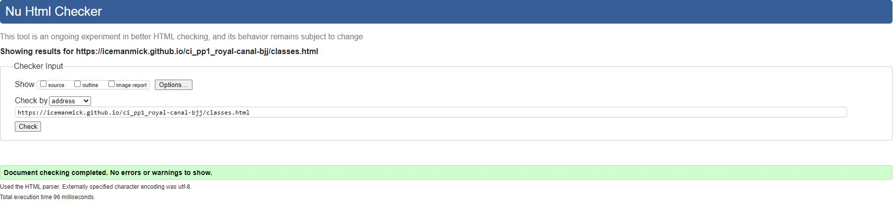

Contact Us
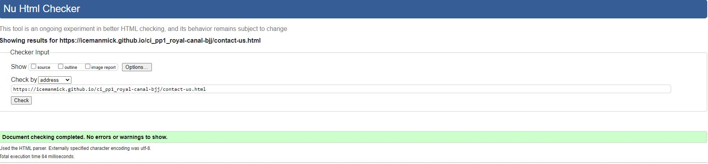

### CSS Validation

The HTML of each of the four pages was passed through the [W3C CSS Validator Website](https://jigsaw.w3.org/css-validator/) also known as "Jigsaw". Each page returned no errors.

Home

About Us
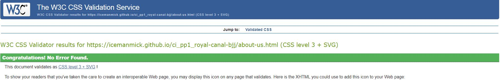

Classes
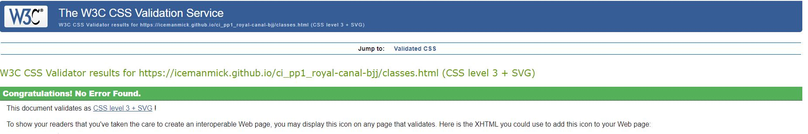

Contact Us
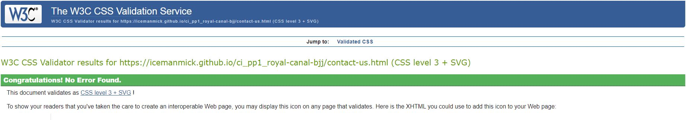

### Performance

The Lighthouse feature in Google Chrome Developer Tools was used to test the performance of each webpage. 

Home
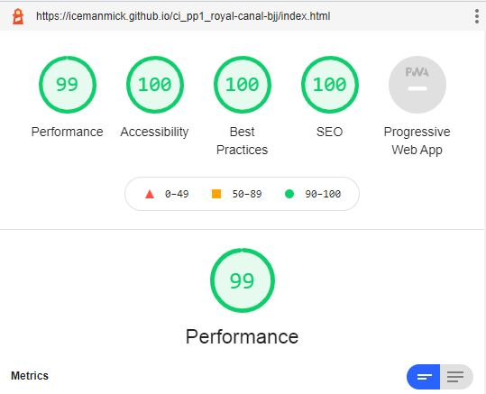

About Us
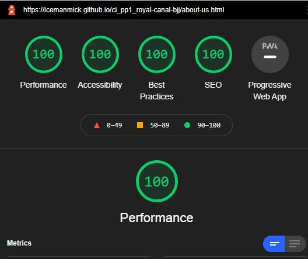

Classes
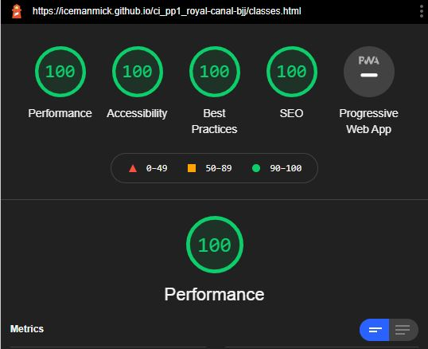

Contact Us
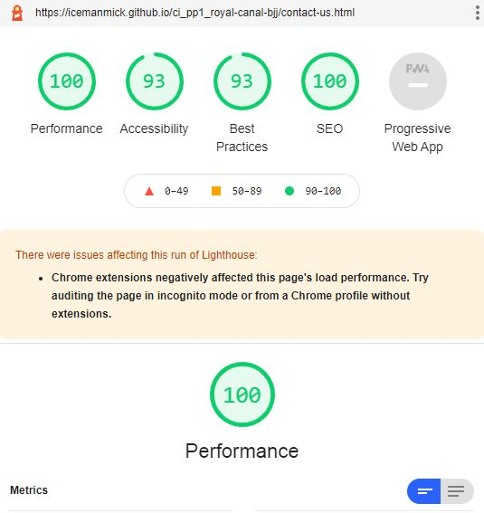

### Accessibility

The [WAVE Web Accesibility Evaluation Tool](https://wave.webaim.org/) was used to test the accessibility of the website. No errors were returned on any of the four pages.

Home
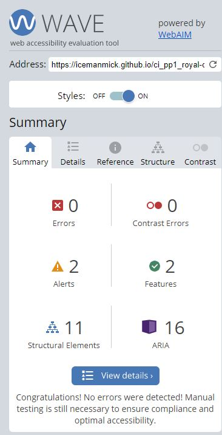

About Us
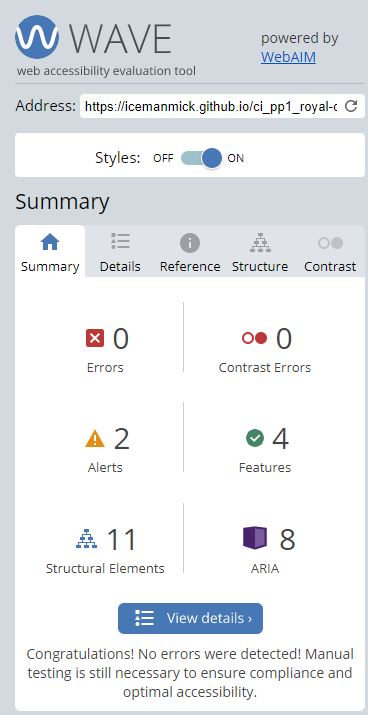

Classes
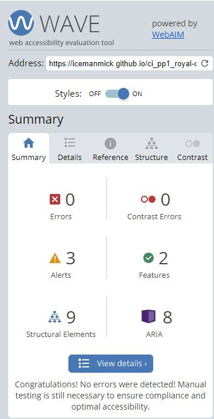

Contact Us
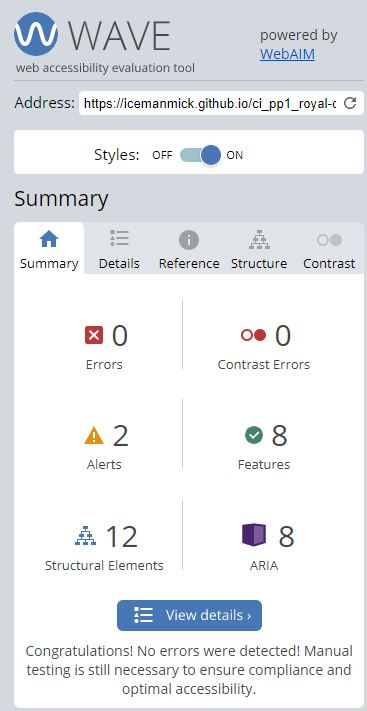

### Browsers

The four webpages were tested on the following browsers:
- Google Chrome
- Safari
- Internet Explorer

All pages and links worked.

### Devices

The four webpages were tested on the following devices:

- Lenovo Z50
- iPad
- One Plus 7 mobile phone

## Unfixed Bugs

- On smaller screen phone devices, the Contact Us button floats unintentionally underneath the rest of the menu options. 
- While visually not desired, the menu buttons do not clash and full functionality is still retained.

## Deployment

This website was deployed using GitHub Pages. The steps for deploying it on GitHub Pages are:
1. Select GitHub repository: IcemanMick/ci_pp1_royal-canal-bjj.
2. Click on the "Settings" menu option on navigation bar provided.
3. Scroll down through the settings to the GitHub Pages Section and click into it.
4. From the source section Branch Menu, click on the drop down tab and select "Branch:Main".
5. Once selected a url to the website will appear above the "Branch: Main" tab.
6. It may take a few minutes to load but after that the link will work and bring you to Royal Canal Bjj.

Please find a live link above the Table of Contents title and additionally here: (https://icemanmick.github.io/ci_pp1_royal-canal-bjj/)

## Technology Used

- Github
- Gitpod
- Git
- Google Chrome
- Paint
- MS Excel
- Balsamiq
- Snipping Tool
- Internet Explorer
- Safari
- Font Awesome
- Google Fonts
- Google Reverse Image Search

## Credits

### Content

- Header HTML and CSS, footer HTML and CSS, form HTML and CSS, and div code HTML and CSS credited in respective comments of HTML pages and CSS page of this website. Credited to [Love Running Project](https://learn.codeinstitute.net/courses/course-v1:CodeInstitute+LR101+2021_T1/courseware/4a07c57382724cfda5834497317f24d5/4d85cd1a2c57485abbd8ccec8c00732c/) by [Code Institute](https://codeinstitute.net/ie/5-day-coding-challenge/?utm_term=code%20institute&utm_campaign=CI+-+IRL+-+Search+-+Brand&utm_source=adwords&utm_medium=ppc&hsa_acc=8983321581&hsa_cam=14304747355&hsa_grp=128775288209&hsa_ad=539453915484&hsa_src=g&hsa_tgt=aud-315575994125:kwd-319867646331&hsa_kw=code%20institute&hsa_mt=e&hsa_net=adwords&hsa_ver=3&gclid=CjwKCAiAzrWOBhBjEiwAq85QZ1su4HjA1qv0Srjo_pu7HKmz-zhcfEWg-pS22i81slyYt8E8j_I6bxoCt3sQAvD_BwE) 
- Help with README.md file from [GitHub](https://docs.github.com/en/github/writing-on-github/getting-started-with-writing-and-formatting-on-github/basic-writing-and-formatting-syntax)   
- Help from Youtube channel of [Geek Tutorials Insert a Google Map to Your Website](https://www.youtube.com/watch?v=KIC0OK9nKXY&ab_channel=GeekTutorials) 
- Credit to [w3schools](https://www.w3schools.com/howto/howto_css_image_center.asp) with help centering CSS images

### Media

Sufficient stock images for Brazilian Jiu Jitsu were limited on [Pexels](https://www.pexels.com/) and [Unsplash](https://unsplash.com/). For this reason images were sourced from Google Images and Google Reverse Image Search was used to credit the correct owners.

- Home page image credited to [Checkmat BJJ](https://checkmatbjj.com/)
- About us image credited to [Out Front Magazine](https://www.outfrontmagazine.com/change-life-jiu-jitsu-art-transformation/)
- Male coach on About Us page is credited as being Lukasz Kowlski of [D15 BJJ Academy](https://www.d15academy.com/carlson-gracie-team.html)
- Female coach on About Us page is credited as being [Ana Yagües](https://www.beltchecker.com/profile.php?id=5802)
- Image on Classes page is credited to [Vagner Rocha Martial Arts](https://www.vagnerrochamartialarts.com/mma-near-me/)
- Contact Us page image is credited to [Eastern Europe BJJ](https://www.bjjee.com/articles/start-training-bjj-5-things-will-happen/)
- Timetable image is credited to the developer.
- Credit to [Font Awesome](https://fontawesome.com/) for icons on Home Page.

## Final Thoughts
It's been a great learning experience with a very steep but very enjoyable curve! Building this website has taught me many lessons which I'll carry forward on future builds and I'm very grateful for the experience.

I'd like to thank:
- My mentor Mo Shami for all of his help and guidance.
- My loving family and girlfriend for their support and for putting up with me.
- Monster Energy, Coca Cola, and coffee for the liquid inspiration and midnight energy.
- Hans Zimmer and Ramin Djawadi for the late night soundtracks.